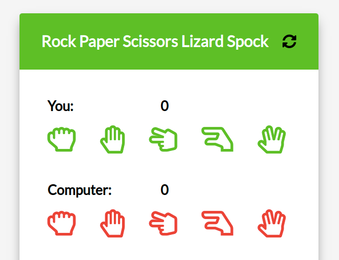

# react_Spock Rock Game: [LIVE DEMO](https://shcoobz.github.io/react_spock-rock-game/)

## Summary

react_spock-rock-game provides an interactive Rock Paper Scissors Lizard Spock game implemented with React. It features a user-friendly interface, engaging animations, and responsive gameplay suitable for all ages.

The core functionality includes:

- Interactive play area where users can choose from Rock, Paper, Scissors, Lizard, or Spock.
- Automated opponent selection using random logic.
- Real-time scoring and game history tracking.
- Dynamic result display using custom rules for the game.

## Features

### Interactive Game Choices

Players can interactively select from Rock, Paper, Scissors, Lizard, or Spock, each represented by clickable icons. This allows for intuitive gameplay and enhances the user experience.

### Real-time Scoring System

The game tracks each round's outcome, updating the scores dynamically. This includes visual feedback for wins, losses, and ties, keeping the gameplay engaging.

### Dynamic Rule Display

Upon each selection, the game dynamically displays the rule that determined the round's outcome, such as "Paper disproves Spock", enhancing understanding and engagement with the game logic.

### Additional Features

- Reset functionality: Allows players to reset the game at any point.
- Confetti animation on winning: Enhances the visual celebration when a player wins.
- Accessibility features: Ensures the game is playable and enjoyable by a wide audience, including those with disabilities.

## Technologies

- **React**: Used for building the user interface with components for maintainable and efficient rendering.
- **PropTypes**: Ensures type safety for component props, improving code reliability and development experience.
- **CSS**: Styles the application, providing a visually appealing and responsive design.

---

_Note: This document provides an overview of react_spock-rock-game. For detailed instructions and more information, please refer to the source code documentation._

_This project is a conversion from an earlier version built with vanilla JavaScript and HTML, available [here](https://github.com/Shcoobz/basicJS_spock-rock-game/). This conversion integrates React to enhance UI reactivity and maintainability._
